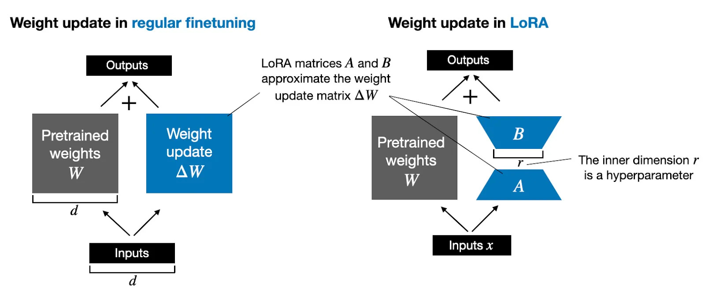
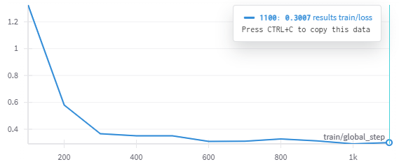
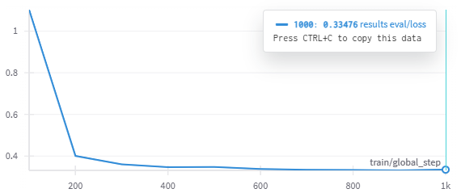
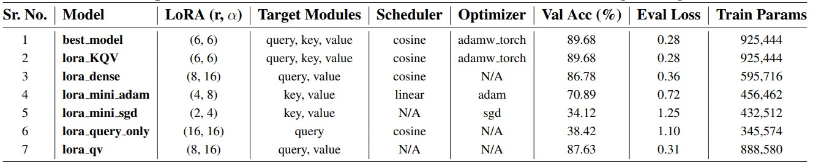

## Efficient Text Classification on AGNEWS using LoRA-Enhanced RoBERTa 

A lightweight and efficient text classification system built on RoBERTa with Low Rank Adaptation (LoRA), achieving top 6% performance in the AGNEWS classification challenge.

##  Project Overview

This project implements a parameter-efficient fine-tuning approach for text classification using RoBERTa and LoRA. The system achieves 95.1% training accuracy and 89.68% validation accuracy while maintaining under 1 million trainable parameters.



## 🏆 Leaderboard Ranking

**Rank:** 10th / 151 teams  
**Group Name:** Rank Adapters  

### Team Members
- **Sunidhi Tandel** (sdt9243)  
- **Tanvi Takavane** (tt2884)

## 📍 Key Features
- **Parameter Efficiency**: Less than 1M trainable parameters
- **High Performance**: 89.68% validation accuracy on AGNEWS dataset
- **Optimized Architecture**: LoRA-enhanced RoBERTa with optimal rank (r=6) and scaling factor (α=6)
- **Comprehensive Training**: Multiple optimizer and scheduler configurations
- **Modular Design**: Easy to experiment with different configurations

## 🔍 Best Model Configuration

### LoRA Parameters
| Parameter | Value |
|-----------|-------|
| Rank (r) | 6 |
| Scaling Factor (α) | 6 |
| Target Modules | query, key, value |
| Dropout | 0.1 |
| Bias | none |

### Training Parameters
| Parameter | Value |
|-----------|-------|
| Optimizer | AdamW |
| Learning Rate | 2e-5 |
| Scheduler | Cosine |
| Batch Size | 16 |
| Epochs | 10 |
| Weight Decay | 0.01 |
| Warmup Ratio | 0.1 |


## Evaluation Graphs

Below are the evaluation graphs that track model performance during training:

- **Training Loss**  
  

- **Validation Loss**  
  

## Model Variants

The image below summarizes the different model variants we experimented with, along with their corresponding evaluation metrics:



## 🛠️ Installation

1. Clone the repository:
```bash
git clone https://github.com/yourusername/roberta-peft-classifier.git
cd roberta-peft-classifier
```

2. Install dependencies:
```bash
pip install -r requirements.txt
```

## 📁 Project Structure

```
roberta-peft-classifier/
├── configs/                 # Configuration files for different model variants
│   ├── best_model.yaml     # Best performing configuration
│   ├── lora_KQV.yaml       # KQV variant configuration
│   └── ...                 # Other configurations
├── core/                    # Core implementation
│   ├── model.py            # Model architecture
│   ├── preprocess.py       # Data preprocessing
│   ├── trainer.py          # Training logic
│   └── test.py             # Testing utilities
├── data/                    # Dataset directory
├── experiments/            # Training results
│   └── best_model/        # Best model artifacts
└── notebooks/              # Jupyter notebooks for analysis
```

## 🔧 Usage

### Training
To train the model with a specific configuration:
```bash
python core/trainer.py --config configs/best_model.yaml
```

### Testing
To evaluate the model:
```bash
python core/test.py --config configs/best_model.yaml
```

## 📈 Results

The best performing model achieved:
- Training Accuracy: 95.1%
- Validation Accuracy: 89.68%
- Training Loss: 0.2986
- Validation Loss: 0.3120
- Total Parameters: 925,444

## References

1. Liu, Y., et al. (2019). RoBERTa: A Robustly Optimized BERT Pretraining Approach
2. Hu, E. J., et al. (2021). LoRA: Low-Rank Adaptation of Large Language Models
3. Dettmers, T., et al. (2023). QLoRA: Efficient Finetuning of Quantized LLMs

## Acknowledgements

We would like to thank everyone whose feedback and suggestions helped me with this project. We sincerely appreciate the support of Professors Chinmay Hegde and the TAs throughout the process.
